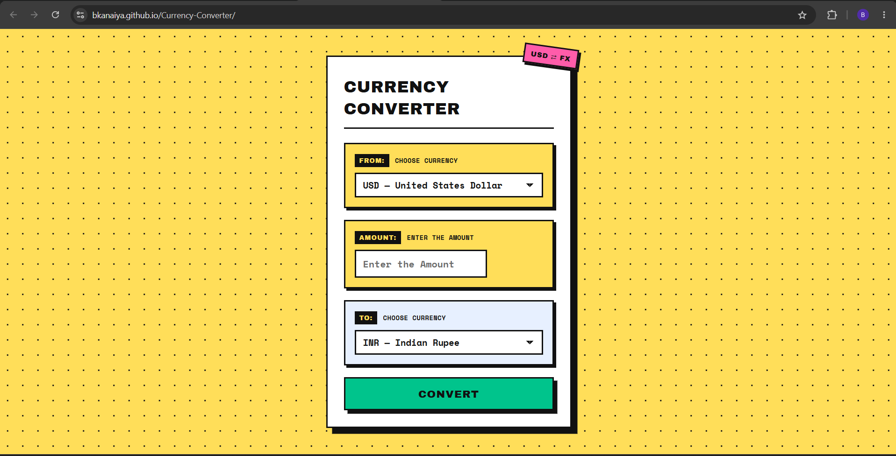

# Currency Converter

A neobrutalist web app for real-time currency conversion using the Frankfurter exchange rate API.

**Live demo:** https://bkanaiya.github.io/Currency-Converter/

## Features
- Dropdown currency selection
- Live exchange rates
- Error handling
- Responsive design

## Tech stack
HTML, CSS, vanilla JavaScript, Frankfurter API

## Running it locally
\`\`\`bash
git clone https://github.com/bkanaiya/Currency-Converter.git
cd Currency-Converter
\`\`\`
Then open `index.html` in a browser. Since this project uses `fetch`, it's best served through a local server rather than opened directly as a file — the VS Code "Live Server" extension works well.

## What I learned
- Fetching and working with live API data using `fetch` and `async/await`
- Handling loading, error, and empty states in the UI instead of assuming requests always succeed
- Writing responsive CSS for a fixed design system across breakpoints

## API used
Exchange rate data from Frankfurter (no API key required).